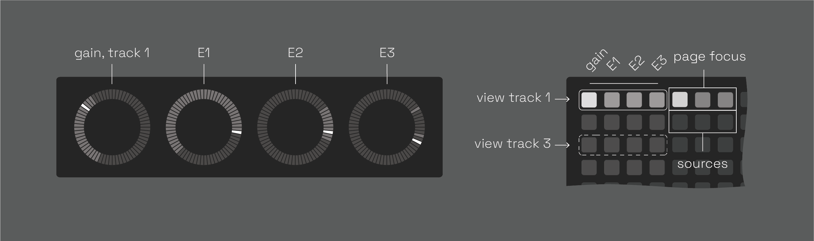
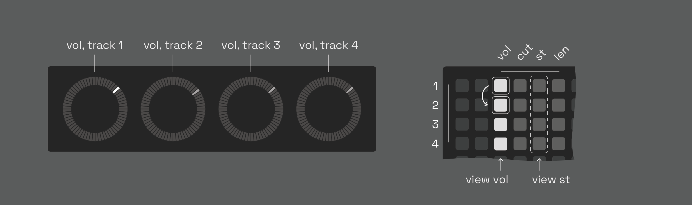

<h1 align="center">NDLS (0.2.0-beta)</h1>


4-track, grid-based, tape looper, delay, & sampler based on softcut. modeless, gesture looping, & performance-minded. highly bendy.

a spiritual successor to [anachronism](https://github.com/andr-ew/prosody#anachronsim), [anaphora](https://github.com/andr-ew/prosody#anaphora), and several unreleased precursors.

currently in beta - any & all feedback is highly appreciated! feel free to create an issue here or send me an email andrewcshike@gmail.com :) (email is usually the best way to reach me). if you're running into trouble, be sure to check out the [issues](https://github.com/andr-ew/ndls/issues) section to see if your issue has already been logged ~
## hardware

**required**

- [norns](https://github.com/p3r7/awesome-monome-norns) (220802 or later)
  - **the required norns version is recent, please be sure that your norns is up-to-date before launching**
- [grid](https://monome.org/docs/grid/) (128, 64, 256, or midigrid)

**also supported**

- arc
- midi mapping

## install

in the maiden REPL, type: 
```
;install https://github.com/andr-ew/ndls/releases/download/v0.2.0-beta/complete-source-code.zip
```

if you wish to install a different version, see the [releases](https://github.com/andr-ew/ndls/releases) tab

## grid UI


the grid is split in two halves with two blocks of [metaparams](#metaparams) mapped to four tracks of softcut. rows 1-4 control tracks 1-4, rows 5-8 also control tracks 1-4.

see [here](lib/doc/alternate_grid_sizes.md) for alternate grid layouts (64, midigrid, 256)

### rec & play

toggle record & playback states. these controls are interdependent. here are some ways to use them:
- record a new loop in a blank buffer:
  - 1 - toggle the **rec** key _on_
  - 2 - play some audio into softcut from TAPE or norns' inputs
  - 3 - toggle **rec** back _off_
  - 4 - softcut will loop what you just played, loop pedal style.
- overdub into a playing loop:
  - 1 - toggle the **rec** key _on_
  - 2 - play some new material into softcut from TAPE or norns' inputs
  - 3 - softcut will record the new material on top of the loop.
    - the volume of the old material is set by the **old** control.
- silence a playing loop:
  - toggle the **play** key _off_
- clear a buffer, and record a brand new loop:
  - 1 - toggle the **play** key _off_
  - 2 - toggle the **rec** key _on_. softcut will clear the old contents of the buffer.
  - 3 - play some new material into softcut from TAPE or norns' inputs
  - 4 - toggle **rec** back _off_
  - 5 - softcut will loop the new material
- use a blank buffer as a delay
  - 1 - toggle the **rec** key _on_
  - 2 - toggle the **play** key _on_
  - 3 - softcut will begin playing and overdubbing, like a delay.
    - delay time is set by time between key presses, as with looping. you can modify the delay time with the **len** or **rate** controls.
    - delay feeback is set by the **old** control

### track focus & page focus

set the focus for the _norns screen & encoders_ (not grid). norns' controls are split into three pages: **MIX**, **TAPE**, and **FILTER**, and are editable intependently across four tracks. 
- note that controls which have neither a white box nor underline are coupled to the same value across tracks, see [metaparams](#metaparams) for advanced info.

### rate: reverse & octave

set the record _and playback_ direction and power-of-two rate multiple (AKA octave, or time division). the rate of change (or slew) for both these controls is touch-reactive. a single key tap will jump instantly to a new value, while hold-and-release gestures increase slew time in proportion to the held duration.
  - to glide to a new pitch with **rate: octave**:
    - 1 - hold one finger on the lit / current value key
    - 2 - press the key of the rate you'd like to glide to
    - 3 - softcut will glide to the new rate, based on the amount of time you were holding down the lit key.
  - to whip a 180 on **rate: reverse**:
    - hold reverse, and release
    - softcut will glide down to rate 0, then glide back up in the other direction, based on the amount of time you were holding down the key.

### buffer

select which audio buffer (1-4) to record & play back from. multiple tracks can share the same buffer, for multi-octave polyphonic looping & decoupled record & play head delay systems. lots of possibilities!
- idea: set two tracks to share the same buffer, and **send** one track to the other.

### preset

select a preset. there is 1 default preset + 6 unique, optionally randomized presets for any/all track controls. by default, only window parameters will be included in the preset. see [metaparams](#metaparams) for advanced info.

### loop

toggle looping on or off. disable for one-shot playback, triggered by the **preset** keys. turn ndls into a sampler!

### send & return

these keys allow you to **send** the output of a track into an invisibe audio bus & **return** them back into the input of another track. tracks with a lit **send** key will be routed into every track with a lit **return** key.
- idea: send a loop track into another track set up like a delay, for echoed loops.

### pattern recorders

the rightmost column contans 8 pattern recorders, these can record & play back any combination of input on grid, norns, or arc. use them like this:

- single tap
  - (blank pattern): begin recording
  - (recording pattern): end recording, begin looping
  - (playing pattern): play/pause playback
- double tap: overdub pattern
- hold: clear pattern

## norns UI

 the norns encoders are mapped to 8 [metaparams](#metaparams) for each track, with norns keys mapped to randomizations of certain values. use the **track focus** + **page focus** components on the top left of the grid to switch between views. changes to any control can be pattern recorded using the grid.

- **track focus:** displays the track focus (set using the top left keys on the grid)
- **E1:** set page focus (also mapped to the grid)
- **E2 - E3:** edit metaparam
- **K2 - K3:** randomize metaparam or other.

### page v (volume)


- **E2:** track output level
- **E3:** volume of old material when overdubbing (i.e. obverdub level/feedback level)
- **K2:** randomize vol
- **K3:** randomize old

### page s (start/length)


- **E2:** slice window start point
- **E3:** slice window length
- **K2:** randomize start point
- **K3:** randomize length
- **K2 + K3:** random window

### page f (filter)


- **E2:** filter cutoff
- **E3:** filter resonance
- **K2:** randomize cutoff
- **K3:** filter type (lowpass, bandpass, highpass, dry)

### page p (pan/pitch)


- **E2:** pan
- **E3:** pitch bend (-1 to +1 octave)
- **K2:** randomize pan

## arc UI

when arc is connected, the **arc focus** component will be visible to the right of **track focus**. the [norns](#norns) section above contains more info about the available [metaparams](#metaparams) (**vol**, **cut**, **st**, **len**). any changes to these controls can be pattern recorded using the grid.

### horizontal orientation



by default, the arc will display four different metaparams from a single track – **vol**, **cut**, **st**, and **len**. press any **row** in the 4x4 grid with one finger to focus on another track.

### vertical orientation



to rotate to the **vertical** orientation, hold & release any two keys in the same **column** with two fingers. now, arc will display the same metaparam across all four tracks. press any **column** to focus on another metaparam ( **vol**, **cut**, **st**, or **len**).


## metaparams

(description)

### metaparam options

#### scope
#### randomization
#### initial preset values

## saving sessions

u can save & load full sessions via the PSET menu. saves all data, buffer audio, and patterns. yay! additionally, your last session is auto-saved to the "last session" pset every time you exit the app.

## roadmap

[read here](https://github.com/users/andr-ew/projects/3/views/1)
