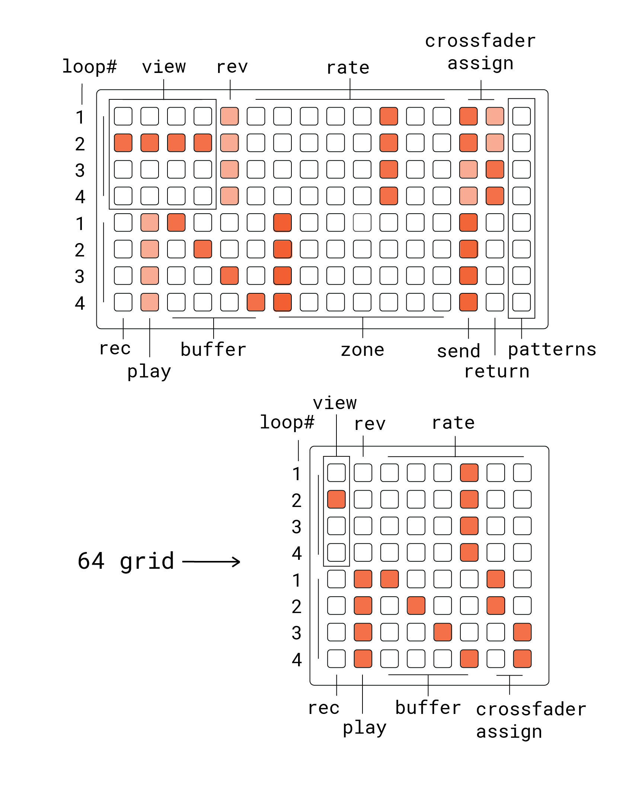

# ndls

4-track asyncronous tape looper, delay, loop splicer. pattern memory, performace oriented, + configurable. and it's ~ bendy ~

spiritual successor to anachronism.

## hardware

**required**
- norns
- grid (128, 64, or midigrid)

**also supported**
- arc
- midi footswitch

## grid

## norns

**mixer view**
- **E1:** crossfader
- **E2-E3:** mix parameter
  - level
  - pan
- **K2:** track focus 1+2 / 3+4
- **K3:** parameter select

**track view**
- **E1:** page
- **E2-E3:** track parameter
  - **pages**
    - **v:** vol, old
    - **s:** start, length
    - **f1:** filter freq, filter amount
    - **f2:** filter response, filter amount
    - **p:** pitch, pan
- **K2-K3:** randomize parameter
- **K1:** edit all

## notes

arc assignable to any of the track view parameters

track parameter randomization
  - play with different random distributions (gaussian is probably fine) for certain parameters (/all parameters?)
  - provide some options for tuning averages & deviations (particularly for length)

scope
- track
  - values never reset, are saved across sessions in params
  - maybe disallow pattern recording ?
- buffer
  - value is unique per-buffer, per-track 
  - values reset when entering a new buffer 
    - when entering a blank buffer, volume resets to 1. when entering a recorded buffer, volume resets to 0.
  - patterns are cleared out on reset
- zone
  - value is unique per-zone, per-buffer, per-track
  - values for all zones reset when entering a new buffer
- random zone
  - zone, but values are automatically randomized upon filling a new buffer in all zones but the first zone
  - start & length are fixed in this zone

scoped UI components are just duplicated for each zone/buffer, so if a pattern is recorded, only one component scope will be mapped to the pattern

idea: when output volume for track becomes 0, play state is always off
- this makes adding new sounds after a crossfade slightly easier

still not really sure whether zone slices within a buffer should be shared across tracks or unique

crossfader assign + send/return could be re-assignable slots ?
- I could also see some shortcuts to parameter randomization being really useful here (start + len, filter)
- leaving them blank could extend existing UI (rate + zones)

## future maybe

sample loading

pattern + audio save/recall

rate intervals (toggle per each)
- octave
- fifth
- maj7
- min7

sync
- sync record/play actions, pattern recorders, quantize window edits
- unique sync setting per zone & pattern recorder ? 
  - map this setting to the grid when holding K1
  - allow copying synced audio to unsynced zone & vice-versa
