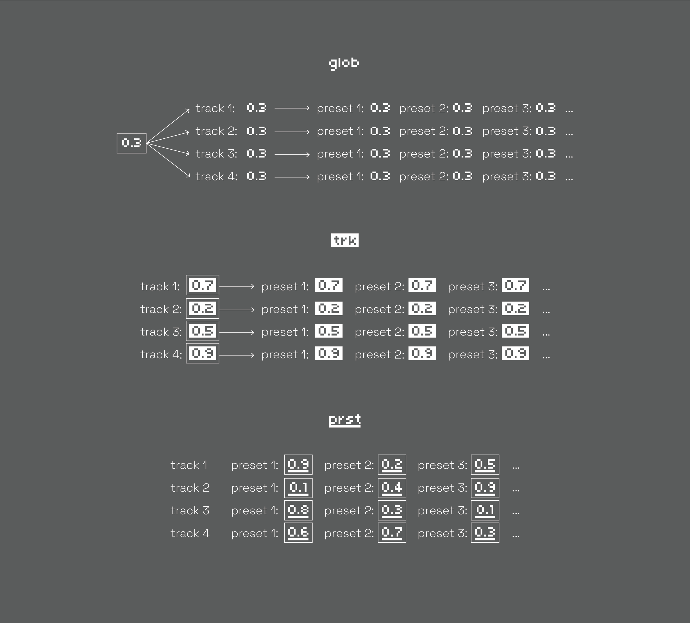
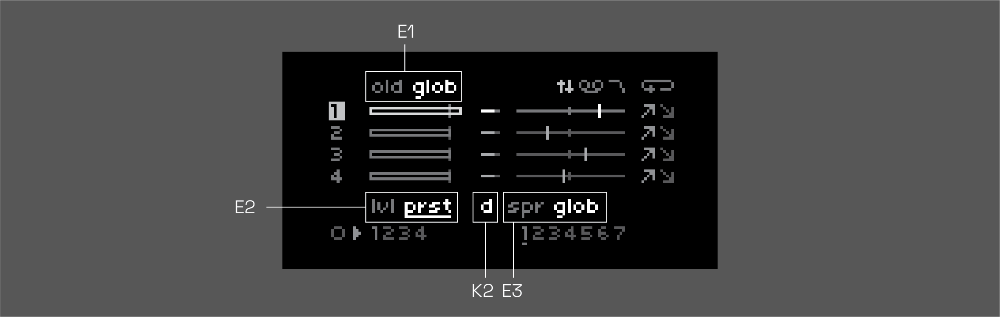

<h1 align="center">NDLS</h1>


4-track, grid-based, tape looper, delay, & sampler based on softcut. modeless, gesture looping, & performance-minded. highly bendy.

a spiritual successor to [anachronism](https://github.com/andr-ew/prosody#anachronsim), [anaphora](https://github.com/andr-ew/prosody#anaphora), and several unreleased precursors.

currently in beta - any & all feedback is highly appreciated! feel free to create an issue here or send me an email andrewcshike@gmail.com :) (email is usually the best way to reach me). if you're running into trouble, be sure to check out the [issues](https://github.com/andr-ew/ndls/issues) section to see if your issue has already been logged ~

## hardware

**required**

- [norns](https://github.com/p3r7/awesome-monome-norns) (220802 or later)
  - **the required norns version is recent, please be sure that your norns is up-to-date before launching**
- [grid](https://monome.org/docs/grid/) (128, 64, 256, or midigrid)

**also supported**

- arc
- midi mapping

## install

install from the maiden catalog (not there yet)

or

in the maiden [REPL](https://monome.org/docs/norns/image/wifi_maiden-images/install-repl.png), type:

```
;install https://github.com/andr-ew/ndls/releases/download/latest/complete-source-code.zip
```

if you wish to install a different version, see the [releases](https://github.com/andr-ew/ndls/releases) tab

## start

recommended: luanch the script from the norns [SELECT](https://monome.org/docs/norns/play/#select) menu.

users with accesibility needs who are unable to acess the norns system menus might consider launching the script from the maiden REPL via the [browser](https://monome.org/docs/norns/maiden/#repl) or another websocket-connected [application](https://github.com/szymonkaliski/maiden-remote-repl):

```
norns.script.load('/home/we/dust/code/ndls/ndls.lua')
```

## grid UI


the grid is split in two halves with two blocks of [metaparams](#metaparams) mapped to four tracks of softcut. rows 1-4 control tracks 1-4, rows 5-8 also control tracks 1-4.

see [here](lib/doc/alternate_grid_sizes.md) for alternate grid layouts (64, midigrid, 256)

note: x & y ranges of each component in the 128 grid layout are labelled between the square brackets [] for those unable to view the daigrams in this document. if you need adjusted labels for 64 or 256 layout please email andrewcshike@gmail.com

### rec & play

[x: 1-2, y: 5-6]

toggle record & playback states. these controls are interdependent. here are some ways to use them:

- record a new loop in a blank buffer:
  - 1 - toggle the **rec** key _on_
  - 2 - play some audio into softcut from TAPE or norns' inputs
  - 3 - toggle **rec** back _off_
  - 4 - softcut will loop what you just played, loop pedal style.
- overdub into a playing loop:
  - 1 - toggle the **rec** key _on_
  - 2 - play some new material into softcut from TAPE or norns' inputs
  - 3 - softcut will record the new material on top of the loop.
    - the volume of the old material is set by the **old** control.
- silence a playing loop:
  - toggle the **play** key _off_
- clear a buffer, and record a brand new loop:
  - 1 - toggle the **play** key _off_
  - 2 - toggle the **rec** key _on_. softcut will clear the old contents of the buffer.
  - 3 - play some new material into softcut from TAPE or norns' inputs
  - 4 - toggle **rec** back _off_
  - 5 - softcut will loop the new material
- use a blank buffer as a delay
  - 1 - toggle the **rec** key _on_
  - 2 - toggle the **play** key _on_
  - 3 - softcut will begin playing and overdubbing, like a delay.
    - delay time is set by time between key presses, as with looping. you can modify the delay time with the **len** or **rate** controls.
    - delay feeback is set by the **old** control

by default, ndls loops asynchronously between tracks & independently from the global clock. see [window scopes](#window-scopes) for info on synchronous modes & [additional params](#additional-params) for clock-synced settings.

### track focus & page focus

[track focus x: 1, y: 1-4; page focus x: 3-5, y: 1]

set the focus for the _norns screen & encoders_ (not grid). norns' controls are split into three pages: [**MIX**](#page-1-mix), [**TAPE**](#page-2-mix), and [**FILTER**](#page-3-filter), and are editable intependently across four tracks, focused with **track focus**.

- note that controls which have neither a white box nor underline are coupled to the same value across tracks, see [metaparams](#metaparams) for advanced info.

### rate: reverse & octave

[reverse x: 7, y: 1-4; octave x: 8-14 ]

set the record _and playback_ direction and power-of-two rate multiple (AKA octave, or time division). the rate of change (or slew) for both these controls is touch-reactive. a single key tap will jump instantly to a new value, while hold-and-release gestures increase slew time in proportion to the held duration.

- to glide to a new pitch with **rate: octave**:
  - 1 - hold one finger on the lit / current value key
  - 2 - press the key of the rate you'd like to glide to
  - 3 - softcut will glide to the new rate, based on the amount of time you were holding down the lit key.
- to whip a 180 on **rate: reverse**:
  - hold reverse, and release
  - softcut will glide down to rate 0, then glide back up in the other direction, based on the amount of time you were holding down the key.

### buffer

[ x: 3-6, y: 5-8 ]

select which audio buffer (1-4) to record & play back from. multiple tracks can share the same buffer, for multi-octave polyphonic looping & decoupled record & play head delay systems. lots of possibilities!

#### sample loading

to load a sample file into a buffer, hold one of the four buffer keys on any track and press K3 when the modal pops up. this will enter the fileselect screen on norns & you can select a file with the keys & encoders.

users with accesibility needs: visual feedback neccesary for file browsing. you can alernatively load a sample by running a line of code like this in the [REPL](https://monome.org/docs/norns/maiden/#repl)
```
sc.loadsample(buffer_number, '/home/we/dust/audio/path/to/file.wav')
```

### preset

[ x: 3-6, y: 7-13 ]

select a preset. there is 1 default preset + 6 unique, optionally randomized presets for any/all track controls. by default, only window parameters will be included in the preset. see [metaparams](#metaparams) for advanced info.

### loop

[ x: 15, y: 1-4 ]

toggle looping on or off. disable for one-shot playback, triggered by the **preset** keys. turn ndls into a sampler!

### send & return

[ send x: 14, y: 5-8; return x: 15, y: 5-8 ]

these keys allow you to **send** the output of a track into an invisibe audio bus & **return** them back into the input of another track. tracks with a lit **send** key will be routed into every track with a lit **return** key.

- idea: send a loop track into another track set up like a delay, for echoed loops.

### pattern recorders

[ x: 16, y 1-8 ]

the rightmost column contans 8 pattern recorders, these can record & play back any combination of input on grid, norns, or arc. use them like this:

- single tap
  - (blank pattern): begin recording
  - (recording pattern): end recording, begin looping
  - (playing pattern): play/pause playback
- double tap: overdub pattern
- hold: clear pattern

## norns UI

across 3 pages, all 3 norns encoders are mapped to 9 [metaparams](#metaparams) for each track, with K2 & K3 mapped to randomizations of certain values. use the **track focus** + **page focus** components on the top left of the grid to switch between views. hold K1 on any page to assign [scopes](#metaparams). changes to any control can be pattern recorded using the grid.

### page 1: MIX


#### E1: perserve/feedback level

the rate at which old material fades away. turn it up in a delay for long echo tails, or turn it down in a loop for tape decay memory loss. note that by default this is globally [scoped](#metaparams).

#### E2: playback/output level

this level is summed with the **gain** param in the params menu to set the actual output level.

#### E3: stereo pan amount

this does not set the pan value directly, but rather, each track has a unique multiple that sets the pan value relative to the **spread** value. by default, in the global scope, spread will spread out all tracks evenly in the stereo feild, but you can switch the [scope](#metaparams) to track or preset to set pans independently, there will just be some uneven scaling between tracks.

#### K2: randomize level

hold to reset to 0db.

#### K3: randomize spread

hold to reset to center.

### page 2: TAPE


#### E1: record & playback rate detune

non-quantized exponential rate multiple. +1 ocave to -1 octave.

#### E2: window position

adjusts both start & end points, displayed in seconds. note that by default this is preset [scoped](#metaparams).

- idea: pattern record some adjustments for pseudo-granular playback.

#### E3: window length

adjusts loop length in seconds. note that by default this is preset [scoped](#metaparams).

#### K2: randomize position

hold to reset to 0

#### K3: randomize length

hold to reset to full length of loop

### page 3: FILTER


#### E1: filter resonance

make stuff sound pointy. note that by default this is globally [scoped](#metaparams).

#### E2: filter cutoff

cutoff frequency, from 20 to 20k Hz.

#### E3: filter type

select between lowpass (default), bandpass, highpass, and bypass (dry).

#### K2: randomize cutoff

hold to reset to 1.

#### K3: randomize type

hold to reset to lowpass

## arc UI

when arc is connected, the **arc focus** component will be visible to the right of **track focus**. the [norns](#norns-ui) section above contains more info about the available params & [metaparams](#metaparams) (**gain**, **cut**, **win**, **len**). any changes to these controls can be pattern recorded using the grid.

### horizontal orientation


by default, the arc will display four different metaparams from a single track – **gain**, **cut**, **win**, and **len**. press any **row** in the 4x4 grid with one finger to focus on another track.

### vertical orientation


to rotate to the **vertical** orientation, hold & release any two keys in the same **column** with two fingers. now, arc will display the same metaparam across all four tracks. press any **column** to focus on another metaparam ( **gain**, **cut**, **win**, or **len**).

## metaparams

the majority of the values mapped to norns, grid, and arc, are **metaparams**. metaparams are a way of connecting one or more intependently-editable values to a single destination, like filter cutoff or window length. each metaparam has an assignable **scope**, which detirmines whether values are edited on a global basis (across tracks), on a per-track basis, or on a per-preset basis.

the three scopes are (predictably) called **global**, **track**, and **preset**. on the norns screen, **track**-scoped metaparams are boxed-out while **preset**-scoped metaparams are underlined. by default, window+length are the only metaparams in the preset scope, while old, spread, and q start out in global scope.



you can think of each metaparam as having either **1**, **4**, or **28** true values, either shared, different between tracks, or different between presets on different tracks, depending on the scope. in the diagram, the true values have the box around it.

### assigning scope



to change a scope, hold K1 on any page & turn the encoder associated with the metaparam you'd like to edit.

[TODO: TAPE page scope capture]

note that on the TAPE page, E1 sets the scope for all rate controls (**rate**, **rate: reverse**, and **rate: octave**), E2 sets the scope for both **window** and **length**, and E3 is left over to set the scope for **loop**

**---------------------------------- BETA 0.2 NOTE --------------------------------------**

- window & length scopes are not yet editable at this time. they are fixed to **preset**

**----------------------------------------------------------------------------------------**

### preset initialization

to assist with differentiation across the 7 presets in **preset** scope, preset values can be optionally auto-randomized upon creating a new loop. this is called **preset intitalization** and there are two options, **random** (x) or **default** (d). while holding K1, preset initilizatition can be assigned using the K2 or K3 associated with the metaparam, assuming the scope has been assigned to preset.

### window scopes

TODO: further descriptions for preset & global behaviors. **BETA NOTE:** these modes aren't done yet.

## PSETs

in ndls, norns PSET system serves two important roles: [saving sessings](#saving-sessions), and [overriding default values](#overriding-default-values).

### saving sessions

ndls saves all session data, including buffer audio & pattern data, alongside your PSETs. just head to PARAMETERS > PSET and save a new PSET. note that the first two slots should already be in use. the first is the **default** slot, always loaded when launching the app. the second slot (**last session**) is always saved to when exiting the app. load this slot if you need to access your last session, but didn't save it.

**---------------------------------- BETA 0.2 NOTE --------------------------------------**

any PSETs saved on a beta version may not load in full on a future version. you can always re-download an [older version](https://github.com/andr-ew/ndls/releases) of ndls to access obsolete PSETs.

**----------------------------------------------------------------------------------------**

### overriding default values

as mentioned, the **default** slot is loaded when starting the app. you can save to this slot to change the default parameter values that are loaded when you start up. this is especially useful for redefining [metaparam](#metaparams) scopes, but you can also tweak default values on global & track scoped metaparams. first, if you have any audio in your buffers (still visible in the TAPE page waveforms, even if all playback is silenced), you might want to clear that out by going to PARAMS > EDIT scrolling down to the **PSET options** header and triggering **force clear all buffers**. then, right below that, there's a shortcut for **overwrite default pset**.

### PSET options

there are a couple more useful tweaks under the **PSET options** header in PARAMS > EDIT

- **reset all params:** this resets all params to the "factory default" state that the app ships with. useful for getting back there after overwriting the default PSET.
- **load last session pset:** shortcut for loading PSET slot 2
- **autosave to default pset:** switch to 'yes' to automatically save to the default PSET upon exiting the app. this will re-load your last session when opening the app.

## additional params

a few more params can be accessed exclusively in the params menu

### track params

- **gain:** this is a second, regular param summed with **level** to set the output level for each track. can be useful to midi map these and still adjust outputs on the track scope if you've assigned **level** to global or preset scope.

### softcut options

- **input routing:** set whether mono audio input comes from the left or right channel
- **alias:** when on, disables the antialiasing filter
- **rec transistion:** set the slew time for the record input levels. can smooth out loop points.

**---------------------------------- BETA 0.2 NOTE --------------------------------------**

clock-sync forthcoming

**----------------------------------------------------------------------------------------**
