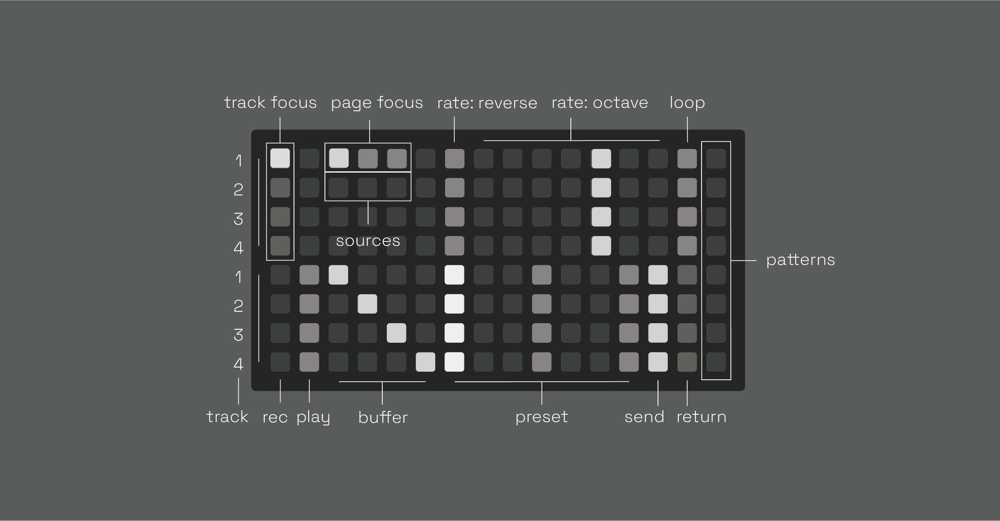
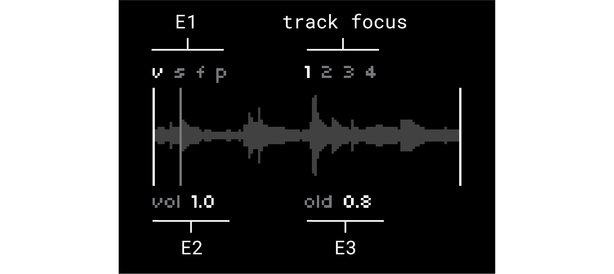
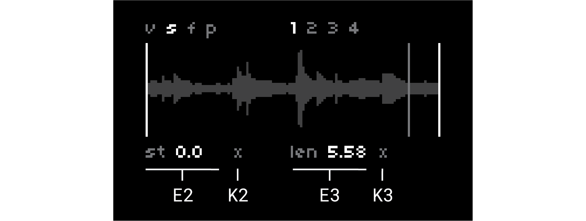
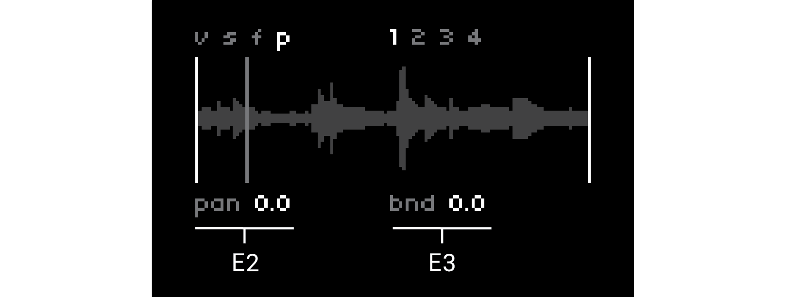

# ndls (beta)

4-track asyncronous tape looper, delay, live sampler & loop slicer based on softcut. pattern memory, performace oriented + configurable. and it's ~ bendy ~

spiritual successor to [anachronism](https://github.com/andr-ew/prosody#anachronsim) & [anaphora](https://github.com/andr-ew/prosody#anaphora)

currently in beta - your feedback is highly appreciated! feel free to create an issue here or send me an email andrewcshike@gmail.com :) (email is usually the best way to reach me). if you're running into trouble, be sure to check out the [issues](https://github.com/andr-ew/ndls/issues) section to see if your issue has already been logged ~

## hardware

**required**

- norns (220321 or later)
- grid (128, 64, 256, or midigrid)

**also supported**

- arc
- midi mapping

## install

in the maiden REPL, type `;install https://github.com/andr-ew/ndls`

## documentation

### grid + arc

the grid is split in two halves with two blocks of controls mapped to four tracks of softcut (or 6 tracks if using a 256 grid). rows 1-4 control tracks 1-4, rows 5-8 also control tracks 1-4.

see [here](lib/doc/alternate_grid_sizes.md) for alternate grid layouts (64, midigrid, 256)

#### bottom half

- **rec & play:** toggle record & playback states. these controls are interdependent. here are some ways to use them:
  - record a new loop in a blank buffer:
    - 1 - toggle the **rec** key _on_
    - 2 - play some audio into softcut from TAPE or norns' inputs
    - 3 - toggle **rec** back _off_
    - 4 - softcut will loop what you just played, loop pedal style.
  - overdub into a playing loop:
    - 1 - toggle the **rec** key _on_
    - 2 - play some new material into softcut from TAPE or norns' inputs
    - 3 - softcut will record the new material on top of the loop.
      - the volume of the old material is set by the **old** control.
  - silence a playing loop:
    - toggle the **play** key _off_
  - clear a buffer, and record a brand new loop:
    - 1 - toggle the **play** key _off_
    - 2 - toggle the **rec** key _on_. softcut will clear the old contents of the buffer.
    - 3 - play some new material into softcut from TAPE or norns' inputs
    - 4 - toggle **rec** back _off_
    - 5 - softcut will loop the new material
  - use a blank buffer as a delay
    - 1 - toggle the **rec** key _on_
    - 2 - toggle the **play** key _on_
    - 3 - softcut will begin playing and overdubbing, like a delay.
      - delay time is set by time between key presses, as with looping. you can modify the delay time with the **len** or **rate** controls.
      - delay feeback is set by the **old** control
- **buffer:** select which audio buffer (1-4) to record & play back from. multiple tracks can share the same buffer.
- **slice:** each audio buffer has 7 independent record & playback sub-windows that you switch between on the fly using the grid. each window has it's own editable **st** & **len** settings. slices 2-7 are auto-randomized upon recording a new loop into a buffer.
- **send & return:** these keys allow you to route the output of a track into the input of another track. all tracks with a lit **send** key will be routed into each track with a lit **return** key.
  - idea: send a loop track into another track set up like a delay, for echoed loops.

#### top half

- **screen focus:** select which track controls to edit on the norns screen
- **arc focus:** select which track controls to edit on arc.
  - by default, arc will display four different controls in one track. press any two keys in the same column of the arc focus matrix to flip orientation, editing four of the same control in different tracks
- **rev:** set record/playback direction. hold & release to glide to the new direction.
- **rate:** record & playback rate, quantized to octaves.
  - press one key with one finger to jump instantly to a new pitch.
  - to ~ glide ~ smoothly to a new pitch, do this:
    - 1 - hold one finger on the lit / current value key
    - 2 - press the key of the rate you'd like to glide to
    - 3 - softcut will glide to the new rate, based on the amount of time you were holding down the lit key. this is an expressive gesture !

#### pattern recorders

the rightmost column contans 8 pattern recorders, these can record & play back any combination of input on grid, norns, or arc. use them like this:

- single tap
  - (blank pattern): begin recording
  - (recording pattern): end recording, begin looping
  - (playing pattern): play/pause playback
- double tap: overdub pattern
- hold: clear pattern

#### arc

arc is mapped to four continous controls for each track. use the **arc focus** component on the grid to set the track focus for all four encoders, or tap two keys in the same column to rotate orientation and edit one control across four tracks simultaneously. the [norns](#norns) section below contains more info about the specific controls (**vol**, **cut**, **st**, **len**). 

any changes to these controls can be pattern recorded using the grid.

### norns

the norns encoders are mapped to 8 continous controls for each track, with norns keys mapped to randomizations of certain values. use the **screen focus** component on the top left of the grid to switch track focus.

any changes to these controls can be pattern recorded using the grid.

#### global

- **E1:** set page focus
- **track focus:** displays the track focus (set using the top left keys on the grid)

#### page v (volume)

- **E2:** track output level
- **E3:** volume of old material when overdubbing (i.e. obverdub level/feedback level)

#### page s (start/length)

- **E2:** slice window start point
- **E3:** slice window length
- **K2:** randomize start point
- **K3:** randomize length
- **K2 + K3:** random window

randomization ranges can be configured in the params menu under **config > randomization**

#### page f (filter)

- **E2:** filter cutoff
- **E3:** filter resonance
- **K3:** filter type (lowpass, bandpass, highpass, dry)

#### page p (pan/pitch)

- **E2:** pan
- **E3:** pitch bend (-1 to +1 octave)
