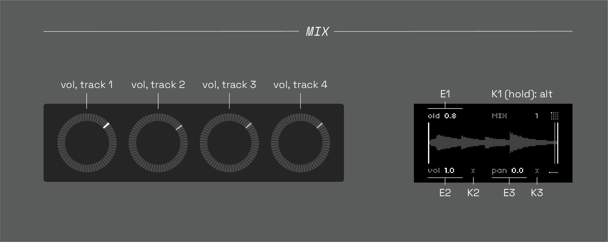
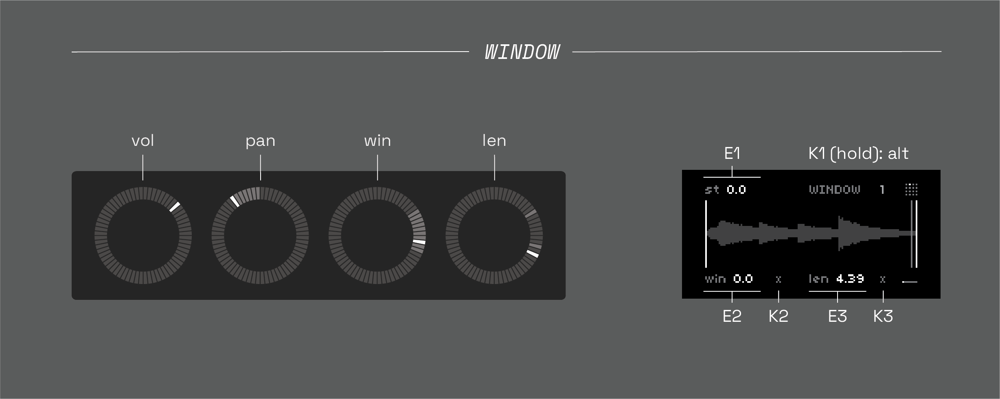
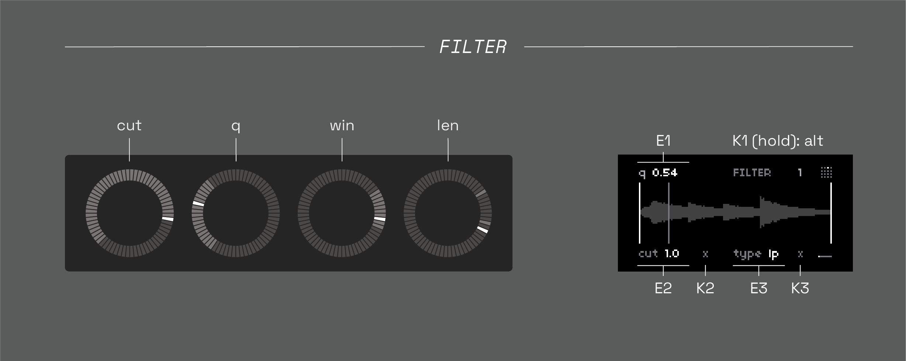
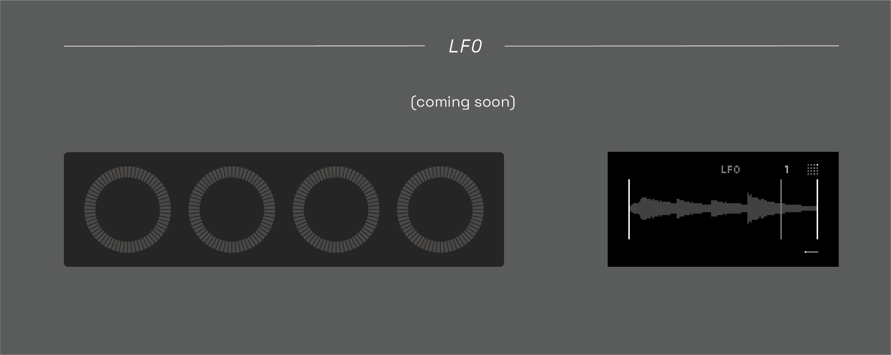

# ndls (0.2.0-beta)

4-track, grid-based, asynchronous tape looper, delay, & sampler based on softcut. modeless, gesture looping, & performance-minded. highly bendy.

a spiritual successor to [anachronism](https://github.com/andr-ew/prosody#anachronsim), [anaphora](https://github.com/andr-ew/prosody#anaphora), and several unreleased precursors.

currently in beta - any & all feedback is highly appreciated! feel free to create an issue here or send me an email andrewcshike@gmail.com :) (email is usually the best way to reach me). if you're running into trouble, be sure to check out the [issues](https://github.com/andr-ew/ndls/issues) section to see if your issue has already been logged ~
## hardware

**required**

- [norns](https://github.com/p3r7/awesome-monome-norns) (220802 or later)
  - **the required norns version is recent, please be sure that your norns is up-to-date before launching**
- [grid](https://monome.org/docs/grid/) (128, 64, 256, or midigrid)

**also supported**

- arc
- midi mapping

## install

in the maiden REPL, type: 
```
;install https://github.com/andr-ew/ndls/releases/download/v0.2.0-beta/complete-source-code.zip
```

if you wish to install a different version, see the [releases](https://github.com/andr-ew/ndls/releases) tab

## quick start

## grid


the grid is split in two halves with two blocks of [metaparams](#metaparams) mapped to four tracks of softcut. rows 1-4 control tracks 1-4, rows 5-8 also control tracks 1-4.

see [here](lib/doc/alternate_grid_sizes.md) for alternate grid layouts (64, midigrid, 256)

### bottom half

- **rec:** toggle record & playback states, loop pedal style.
  - 1 - tap **rec** while the assigned **buffer** is blank to begin the initial recording
  - 2 - tap **rec** again to begin looping + disable overdubs, for a traditional looping experience.
  - 3 - while the **buffer** is non-blank, **rec** sets the overdub state
  - 4 - **reset:** hold the **rec** key to reset the active buffer of the track. this will clear buffer audio and reset any/all data.
- **loop:** set the loop state. disable for one-shot playback, triggered by the **preset** keys. turn ndls into a sampler!
- **buffer:** select which audio buffer (1-4) to record & play back from. multiple tracks can share the same buffer.
- **preset:** 1 default preset + 8 randomized presets for any/all data in the track (loop windows, filter, rate, mix). see [metaparams](#metaparams) for advanced info.

### top half

- **norns/arc view:** set the track + page displayed on norns + arc. track selection on the y axis, page selection on the x axis.
- **rev:** set record/playback direction. hold & release to glide to the new direction.
- **rate:** record & playback rate, quantized to octaves.
  - press one key with one finger to jump instantly to a new pitch.
  - to ~ glide ~ smoothly to a new pitch, do this:
    - 1 - hold one finger on the lit / current value key
    - 2 - press the key of the rate you'd like to glide to
    - 3 - softcut will glide to the new rate, based on the amount of time you were holding down the lit key. this is an expressive gesture !
- **send & return:** these keys allow you to route the output of a track into the input of another track. all tracks with a lit **send** key will be routed into each track with a lit **return** key.
  - idea: send a loop track into another track set up like a delay, for echoed loops.


### pattern recorders

the rightmost column contans 8 pattern recorders, these can record & play back any combination of input on grid, norns, or arc. use them like this:

- single tap
  - (blank pattern): begin recording
  - (recording pattern): end recording, begin looping
  - (playing pattern): play/pause playback
- double tap: overdub pattern
- hold: clear pattern

## norns + arc

the norns screen/encoders/keys + arc are paginated using the top left section of the grid. there are four pages for each of the four tracks. each page contains [metaparams](#metaparams).
- **E1 - E3:** edit metaparam
- **K2 - K3:** (**x**) randomize metaparam
- **arc:** edit metaparams

### page 1: MIX



- **old:** volume of old material when overdubbing (i.e. obverdub level/feedback level). high levels are loop-like, low levels are delay-like.
- **vol:** output level. on arc, all four tracks are available at once.
- **pan:** output panning

### page 2: WINDOW



- **st:** loop window start point
- **win:** loop window position
- **len:** loop window length

### page 3: FILTER



- **q:** filter resonance
- **cut:** filter cutoff freq
- **type:** filter type (lowpass, bandpass, highpass, dry signal)

### page 4: LFO



## metaparams

(diagram)

### metaparam options

(coming soon)

## saving sessions

u can save & load full sessions via the PSET menu. saves all data, buffer audio, and patterns. yay! additionally, your last session is auto-saved to the "last session" pset every time you exit the app.
